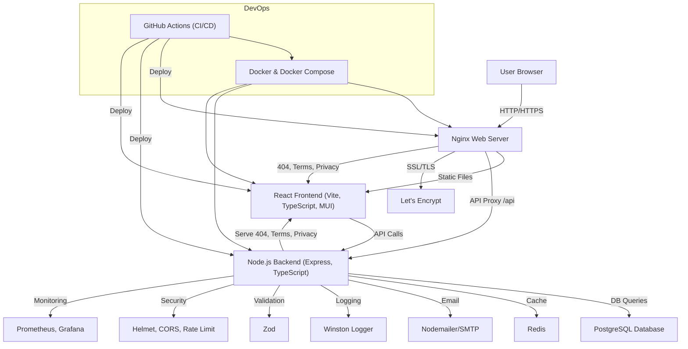

# SmashLabs Technical Architecture Documentation

## System Overview

SmashLabs is a modern web application built with a robust tech stack that ensures scalability, security, and maintainability. The system follows a microservices architecture pattern with clear separation of concerns.

## Architecture Diagram

## Detailed Tech Stack

### 1. Frontend Layer
#### Core Technologies
- **React 18+**: Modern UI library for building interactive interfaces
  - Hooks for state management
  - Context API for global state
  - React Router for navigation

#### Development Tools
- **TypeScript 5.0+**: Type-safe JavaScript
  - Strict type checking
  - Enhanced IDE support
  - Better code maintainability

#### Build & Development
- **Vite**: Next-generation frontend tooling
  - Fast hot module replacement
  - Optimized production builds
  - Modern ESM-based development

#### UI Components
- **Material-UI (MUI)**: Production-ready component library
  - Customizable theme system
  - Responsive design components
  - Accessibility features

#### Additional Libraries
- **Axios**: Promise-based HTTP client
- **Framer Motion**: Animation library
- **React Query**: Data fetching and caching
- **React Hook Form**: Form handling

### 2. Backend Layer
#### Core Framework
- **Node.js**: JavaScript runtime
- **Express**: Web framework
  - RESTful API endpoints
  - Middleware support
  - Error handling

#### Type Safety
- **TypeScript**: Type-safe backend development
  - Interface definitions
  - Type guards
  - Enhanced error catching

#### Data Validation
- **Zod**: Schema validation
  - Runtime type checking
  - Input sanitization
  - API request validation

#### Security
- **Helmet**: Security middleware
  - HTTP headers protection
  - XSS prevention
  - Content Security Policy

#### Communication
- **CORS**: Cross-origin resource sharing
- **express-rate-limit**: Rate limiting
- **Nodemailer**: Email functionality

### 3. Database Layer
#### Primary Database
- **PostgreSQL**: Relational database
  - ACID compliance
  - Complex queries
  - Data integrity

#### Caching
- **Redis**: In-memory data store
  - Session management
  - Rate limiting
  - Real-time features

### 4. Infrastructure
#### Web Server
- **Nginx**: Reverse proxy
  - SSL termination
  - Static file serving
  - Load balancing

#### Security
- **Let's Encrypt**: SSL/TLS certificates
- **Rate Limiting**: DDoS protection
- **CORS Policies**: Cross-origin security

#### Containerization
- **Docker**: Container platform
  - Isolated environments
  - Consistent deployments
  - Easy scaling

#### CI/CD
- **GitHub Actions**: Automation
  - Automated testing
  - Deployment pipelines
  - Code quality checks

### 5. Monitoring & Logging
#### Metrics
- **Prometheus**: Metrics collection
  - Performance monitoring
  - Resource usage tracking
  - Alert rules

#### Visualization
- **Grafana**: Metrics dashboard
  - Real-time monitoring
  - Custom dashboards
  - Alert notifications

#### Logging
- **Winston**: Logging system
  - Structured logging
  - Log levels
  - Error tracking

### 6. Development Tools
#### Code Quality
- **Prettier**: Code formatting
- **ESLint**: Code linting
- **Jest**: Testing framework

#### Environment
- **.env**: Configuration
- **dotenv**: Environment variables
- **cross-env**: Cross-platform env vars

## Security Measures
1. HTTPS enforcement
2. Rate limiting
3. Input validation
4. XSS protection
5. CSRF protection
6. SQL injection prevention
7. Secure headers
8. Regular security audits

## Performance Optimizations
1. Redis caching
2. Database indexing
3. Code splitting
4. Asset optimization
5. Lazy loading
6. Compression
7. CDN integration

## Deployment Strategy
1. Docker containerization
2. CI/CD automation
3. Blue-green deployment
4. Rollback capability
5. Health checks
6. Monitoring integration

## Future Considerations
1. Microservices architecture
2. Serverless functions
3. GraphQL implementation
4. WebSocket integration
5. Mobile app development
6. Internationalization
7. Advanced analytics 