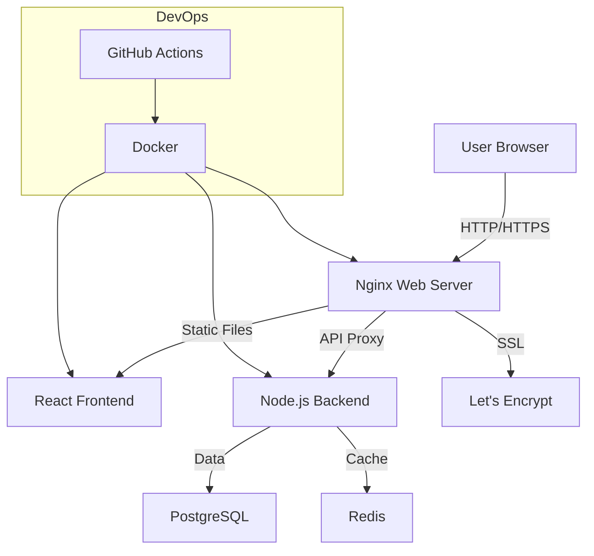

# SmashLabs Tech Stack
## A Modern Web Application

---

## System Architecture Overview

---

## Frontend Stack

### Core Technologies
- **React** - UI Library
- **TypeScript** - Type Safety
- **Vite** - Build Tool
- **Material-UI** - Components

### Key Features
- Modern UI/UX
- Responsive Design
- Type Safety
- Fast Development

---

## Backend Stack

### Core Technologies
- **Node.js** - Runtime
- **Express** - Framework
- **TypeScript** - Type Safety
- **PostgreSQL** - Database
- **Redis** - Caching

### Key Features
- RESTful APIs
- Data Validation
- Security
- Performance

---

## Infrastructure

### Core Components
- **Nginx** - Web Server
- **Docker** - Containers
- **GitHub Actions** - CI/CD
- **Let's Encrypt** - SSL

### Key Features
- Scalable
- Secure
- Automated
- Maintainable

---

## Security Features

### Protection Layers
- HTTPS/SSL
- Rate Limiting
- Input Validation
- XSS Protection
- CSRF Protection

---

## Performance Features

### Optimizations
- Redis Caching
- Database Indexing
- Code Splitting
- Asset Optimization
- CDN Integration

---

## Development Tools

### Quality Assurance
- Prettier - Code Formatting
- ESLint - Code Linting
- Jest - Testing
- TypeScript - Type Checking

---

## Thank You!
### Questions? 