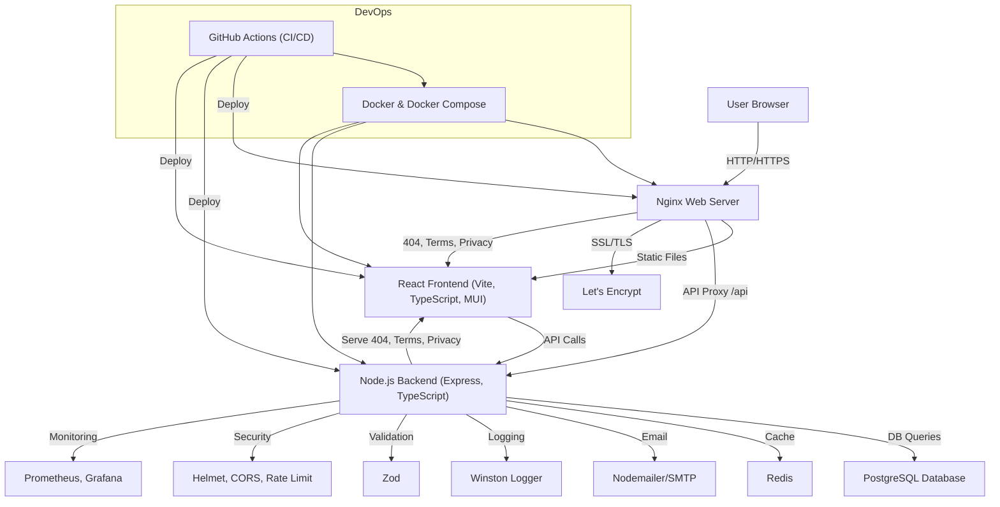

# SmashLabs Website Tech Stack

## Architecture Flowchart

## Tech Stack Details

### Frontend
- **React**: Modern JavaScript library for building user interfaces.
- **TypeScript**: Strongly-typed superset of JavaScript for safer, scalable code.
- **Vite**: Fast build tool and dev server for modern web projects.
- **Material-UI (MUI)**: Component library for beautiful, accessible UIs.
- **Axios**: For making HTTP requests to the backend API.
- **Framer Motion**: For smooth animations and transitions.
- **React Router**: For client-side routing and navigation.

### Backend
- **Node.js**: JavaScript runtime for server-side code.
- **Express**: Minimal, flexible web framework for Node.js.
- **TypeScript**: For type safety and maintainability.
- **Zod**: For runtime validation and type-safe schemas.
- **Helmet**: Sets HTTP headers for security.
- **CORS**: Handles Cross-Origin Resource Sharing.
- **express-rate-limit**: Protects APIs from brute-force attacks.
- **Winston**: For structured logging.
- **Nodemailer**: For sending transactional emails (contact, booking, etc.).

### Database & Caching
- **PostgreSQL**: Relational database for persistent data storage.
- **Redis**: In-memory data store for caching and fast lookups.

### DevOps & Infrastructure
- **Nginx**: Web server for serving static files, SSL termination, and reverse proxying API requests.
- **Let's Encrypt**: Provides free SSL/TLS certificates for HTTPS.
- **Docker & Docker Compose**: Containerizes the app for consistent deployment and easy scaling.
- **GitHub Actions**: Automates CI/CD pipelines for testing, building, and deploying the app.

### Monitoring & Observability
- **Prometheus**: Collects metrics from the backend for monitoring.
- **Grafana**: Visualizes metrics and sets up alerts.

### Other
- **Prettier & ESLint**: For code formatting and linting.
- **Jest**: For unit and integration testing.
- **.env files**: For environment-specific configuration and secrets. 